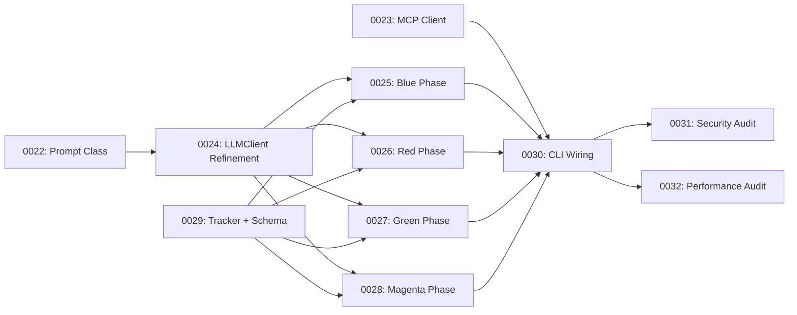

## Goal
Eliminate all stubs, placeholder code, and missing driver loops from the tdd-harness codebase so that the system can autonomously execute a full Amber → Blue → Red → Green → Magenta → Violet TDD lifecycle.

## Stub → Task Traceability Matrix

Every stub, placeholder, and gap identified during audit is mapped below to the task that resolves it.

| # | Stub / Gap Location | Description | Resolving Task |
|:--|:--|:--|:--|
| 1 | `prompt.py` — **does not exist** | SDD §3 specifies a `Prompt` class with SHA256 hashing and `.prompt-cache.yaml`. `LLMClient` expects it. | **0022** |
| 2 | `mcp_client.py:38` — `connect()` is `pass` | Stub: no real MCP server connection | **0023** |
| 3 | `mcp_client.py:56` — `get_tools()` returns `[]` | Stub: returns hardcoded empty list | **0023** |
| 4 | `mcp_client.py:74` — `call_tool()` returns `{}` | Stub: returns hardcoded empty dict | **0023** |
| 5 | `llm.py:72-74` — "1 char = 1 token" placeholder | Token estimation heuristic, not production logic | **0024** |
| 6 | `llm.py:86-87` — "for this simple implementation" | Compression uses hardcoded string, not `compression_prompt.yaml` | **0024** |
| 7 | `llm.py` — no tool-call loop | `chat()` doesn't handle OpenAI tool calls | **0024** |
| 8 | `llm.py` — no `keep_turns` pruning | History is never pruned | **0024** |
| 9 | `cli.py:167` — Blue phase is log-only | `controller.current_phase = Phase.BLUE` with no LLM call | **0025** + **0030** |
| 10 | `controller.py:664-667` — `check_blue_exit()` stub | "For now, we mock the parsing" — test count verification is `pass` | **0025** |
| 11 | `cli.py:170` — Red phase is log-only | `controller.current_phase = Phase.RED` with no LLM call | **0026** + **0030** |
| 12 | `cli.py:173` — Green phase is log-only | `controller.current_phase = Phase.GREEN` with no LLM call | **0027** + **0030** |
| 13 | `controller.py:711-721` — Magenta LLM invocation stubbed | "hypothetical fix_coverage" — commented out, `_ = context; pass` | **0028** |
| 14 | `controller.py:738` — `TODO: dynamic handling` | Abort path has no report writing | **0028** |
| 15 | `controller.py` — `AntiThrashingTracker` not instantiated | Tracker exists in `tracker.py` but is never wired into controller | **0029** |
| 16 | `registry.py:179` — "Defaulting to string for test simplicity" | All tool parameters typed as `"string"` regardless of annotation | **0029** |
| 17 | `cli.py:166-176` — no task file routing | Active task not parsed from `docs/tasks/ready/` | **0030** |
| 18 | `cli.py` — `LLMClient` and `Prompt` not instantiated | Controller creates raw `AsyncOpenAI` per sub-agent call | **0030** |
| 19 | `controller.py` — `ContextBuilder` never used | Class exists in `context.py` but no code imports or populates it | **0025-0028** |
| 20 | `.prompt-cache.yaml` — not implemented | SDD §3 specifies this file; no code reads/writes it | **0022** |

---

## Execution Sequence

Tasks are ordered by dependency. The dependency chain is:

### Recommended Execution Order

| Order | Task ID | Title | Role | Blocks |
|:--|:--|:--|:--|:--|
| 1 | **0022** | Prompt Class with Token Cache | coder | 0024 |
| 2 | **0023** | MCP Client Real Connectivity | coder | 0030 |
| 3 | **0024** | LLMClient Refinement | coder | 0025, 0026, 0027, 0028 |
| 4 | **0029** | Tracker Integration + Schema Fix | coder | 0025, 0026, 0027, 0028 |
| 5 | **0025** | Blue Phase Driver Loop | coder | 0030 |
| 6 | **0026** | Red Phase Driver Loop | coder | 0030 |
| 7 | **0027** | Green Phase Driver Loop | coder | 0030 |
| 8 | **0028** | Magenta Phase LLM Loop | coder | 0030 |
| 9 | **0030** | CLI End-to-End Wiring | coder | 0031, 0032 |
| 10 | **0031** | Security Audit | security | — |
| 11 | **0032** | Performance Audit | performance | — |

> [!IMPORTANT]
> Tasks 0022 and 0023 have no mutual dependency and can be parallelized. Tasks 0024 and 0029 can also be parallelized. Tasks 0025-0028 can be parallelized once 0024 and 0029 are complete.

---

## Open Questions

> [!IMPORTANT]
> **Controller LLM Client Consolidation**: The `controller.py` currently creates raw `AsyncOpenAI` clients in 3 places (`success`, `_generate_post_mortem`, `ask_researcher`). Should task 0030 refactor these to use the shared `LLMClient` instance, or should they remain isolated to keep sub-agents stateless?

> [!NOTE]
> **MCP Server Config**: Task 0023 requires knowing the actual MCP server connection protocol (stdio, SSE, etc). The current `server_config` dict is empty. Should the `config.yaml` schema be extended to define MCP server entries, or will these be populated externally?

---

## Verification Plan

### Automated Tests
- `uv run pytest` — all 66+ existing tests must continue to pass after each task.
- Each task adds new tests; final test count should exceed 100.

### Manual Verification
- After task 0030, execute `bin/tdd-harness.sh` with a sample task file and verify the full Amber→Violet lifecycle completes or aborts with actionable errors.
