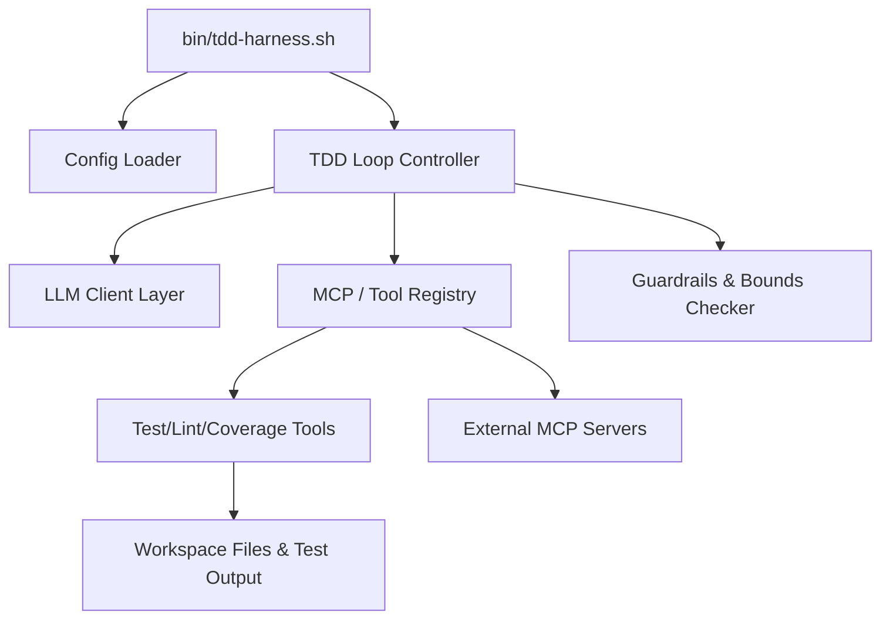

# 🗺 Software Design Document: tdd-harness

## Reference Documents
- [Harness Tools Registry](file:///home/mike/Projects/mike-heckman/tdd-harness/docs/tools.md)
- [Architecture Decision Records (ADRs)](file:///home/mike/Projects/mike-heckman/tdd-harness/docs/architecture-decisions/)

## 1. Requirements & Scope
*Last Updated: 2026-06-16*

The `tdd-harness` is a Python-based utility to run AI-driven development loops enforcing strict Test-Driven Development (TDD).
- **Configurable LLM**: Connects to OpenAI-compatible endpoints.
- **Language-Agnostic**: Configures external test, lint, coverage commands via a config file.
- **MCP Tool Registry**: Supports Model Context Protocol (MCP) servers and dynamic Python modules for extensibility.
- **TDD Loop**: Runs a specialized Red-Green-Blue cycle enforcing strict boundaries, test tracking, and line coverage guardrails.
- **Context Conservation**: Implements post-mortem summarization and staging buffers to keep LLM context minimalist and token-efficient.

## 1.1 The TDD Lifecycle Phases
The core execution loop consists of five strict phases. For detailed context payloads and permissions, refer to the phase definitions:
- [Phase 01: Amber](file:///home/mike/Projects/mike-heckman/tdd-harness/docs/phases/01-amber-baseline-check.md)
- [Phase 02: Blue](file:///home/mike/Projects/mike-heckman/tdd-harness/docs/phases/02-blue-structural-blueprint.md)
- [Phase 03: Red](file:///home/mike/Projects/mike-heckman/tdd-harness/docs/phases/03-red-test-generation.md)
- [Phase 04: Green](file:///home/mike/Projects/mike-heckman/tdd-harness/docs/phases/04-green-develop-implementation.md)
- [Phase 05: Magenta](file:///home/mike/Projects/mike-heckman/tdd-harness/docs/phases/05-magenta-coverage-guardrail.md)
- [Phase 06: Violet](file:///home/mike/Projects/mike-heckman/tdd-harness/docs/phases/06-violet-review-and-signoff.md)
- [Phase 07: Cyan (Sub-Routine)](file:///home/mike/Projects/mike-heckman/tdd-harness/docs/phases/07-cyan-research-subagent.md)

## 2. High-Level Architecture


### 2.1 Context Isolation & Token Conservation
To protect the LLM's context window and prevent token bloat during failure loops:
- **Staging Buffers**: The LLM cannot edit files directly. It stages changes in-memory. The harness writes the file, runs tests, and immediately reverts on failure to keep the working tree clean.
- **Post-Mortem Summarization**: When a test or linter fails during the Blue/Green phases, the harness avoids injecting the massive raw traceback into the persistent chat history. Instead, the harness makes a secondary LLM call to generate a concise summary of the failure root cause. The file is then reverted, the raw error/bad code is wiped from the context window, and the "Failure Summary" is injected into subsequent prompts.

## 3. Configuration & State Resolution
The project is executed from a single entrypoint (e.g., `bin/tdd-harness.sh`).
On startup, the harness looks for a `.tdd-harness/` directory which contains the core configuration files (`config.yaml`, `system_message.yaml`) and future skills/extensions.

**Resolution Order:**
1. Specified project directory (if passed via CLI arg).
2. Current working directory (`./.tdd-harness/`).
3. User Home directory (`~/.tdd-harness/`).

If the `.tdd-harness/` directory is not found in any location, the harness MUST fail fast with an actionable error instructing the user to run `tdd-harness init`.

### Configuration Structure (`.tdd-harness/config.yaml`)
```yaml
llm:
  provider: openai
  base_url: http://localhost:8000/v1
  context_size: 8192
  minimum_available_context: 2048
  keep_turns: 1

harness:
  coverage_threshold: 80.0
  max_uncovered_lines: 50
  anti_thrashing:
    max_duplicate_failures: 3
    max_window_failures: 4
    window_size: 5

mcp_servers: []
extensions: []
```

### Prompt Definition Structure
The project strictly separates read-only configuration from mutable runtime state to support read-only VM mounts.

**Read-Only Prompt (`.tdd-harness/prompts/system_message.yaml`)**
```yaml
prompt: |
  You are an AI developer...
```

**Mutable State Tracking**
The harness maintains state in the project root:
- `.agent-metrics.yaml`: Stores testing state (last known coverage %, untested lines).
- `.prompt-cache.yaml`: Stores LLM token caches.

```yaml
# .prompt-cache.yaml
prompt_caches:
  system_message:
    prompt_hash: "a1b2c3d4e5..."
    token_counts:
      gemma-4-26b-a4b-it-6bit: 379
```

**`.tdd-harness/prompts/compression_prompt.yaml`**
```yaml
prompt: |
  Summarize the following chat history concisely, retaining all critical technical decisions and failures.
```

## 4. MCP Tool Registry & Capabilities
The harness standardizes all capabilities around the **Model Context Protocol (MCP)**.
- **File Access Security**: The AI is **denied** raw bash/shell access. It may only read and write via specific `read_file` and `write_file` tools.

## 5. TDD Cycle & Guardrail Controller
The harness operates on a strict 5-Phase lifecycle. File access (`ro` vs `rw`) is enforced programmatically at the tool-call layer (denying write tools to specific directories based on phase), rather than via OS-level disk permissions, to prevent the LLM from bypassing tests.

1. **Amber (Baseline Check)**: `src/: rw, test/: ro`. Validates tests and linter are green. Ensures the environment is clean.
2. **Blue (Structural Blueprint)**: `src/: rw, test/: ro`. Generates interfaces/stubs. Code must pass `ruff` (no syntax errors).
3. **Red (Test Writing)**: `src/: ro, test/: rw`. Writes failing tests.
   - Must fail due to an assertion (`AssertionError` / `NotImplementedError`).
   - Must include a `"""Docstring"""` detailing the test concept.
4. **Green (Implementation)**: `src/: rw, test/: ro`. Satisfies the failing tests.
   - Test AST docstrings are injected directly into the prompt to provide the "Test Concept".
5. **Magenta (Coverage Guardrail)**: `src/: ro, test/: rw`. Loops file-by-file using `lcov` coverage reports to ensure target coverage is met.

### Toolchain Adapter Interfaces
To support multiple languages and granular file-level execution, the harness delegates toolchain operations to three distinct interfaces: `TestAdapter`, `LintAdapter`, and `CoverageAdapter`.
- Adapters are mapped in the configuration (`adapters: { test: pytest, lint: ruff, coverage: lcov }`).
- The `TestAdapter` parses structured outputs (e.g., `pytest-reportlog`) returning exact failure classes.
- Both `TestAdapter` and `LintAdapter` can be invoked globally or passed a specific `file_path` to optimize execution time during tight loops.

### Context Token Tracking & Cache Invalidation
The harness encapsulates prompts via a dedicated `Prompt` class. To support read-only configuration mounts, the token cache is decoupled from the prompt definition.
1. The `Prompt` class reads `system_message.yaml` and calculates the SHA256 hash.
2. It looks up the `prompt_caches.system_message` entry in the mutable `.prompt-cache.yaml` file.
3. If the calculated hash does not match the stored `prompt_hash`:
   - The user has modified the prompt. 
   - The `token_counts` dictionary for that prompt is cleared, and the new hash is written to `.prompt-cache.yaml`.
4. When the LLM adapter needs to record a new token count, it calls `prompt.update_token_size(model, count)`, which safely updates the `.prompt-cache.yaml` state file.

**Context Deadlock Prevention**: If the static token size of the `system_message` and `task` exceed `context_size - minimum_available_context`, the harness immediately aborts the run with a "Context Exhausted" error to prevent infinite compression loops.

### Loop Thrashing Mechanism
- **Rolling Window Tracker**: The harness hashes each LLM tool-call and tracks execution status.
- **Termination Conditions**: The loop terminates with an error if X identical failures occur, or Y failures occur within Z requests.
- **Dirty Exit**: Upon termination, the harness halts and explicitly leaves the workspace dirty so the human reviewer can inspect the exact point of AI failure. No automatic rollback is performed.

## 6. Architectural Ticket Requirements
1. **Explicit Request & Justification**: Blue phase tickets must explicitly state it is necessary and provide justification.
2. **Follow-up Audits**: The architect MUST scaffold a Security Review and a Performance Review ticket specifically to follow immediately after the Blue phase.